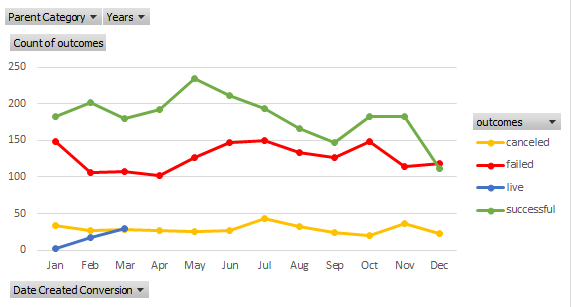
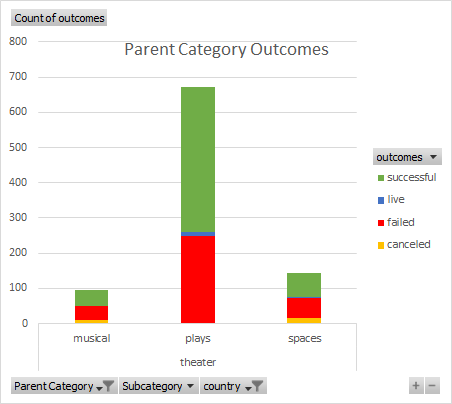
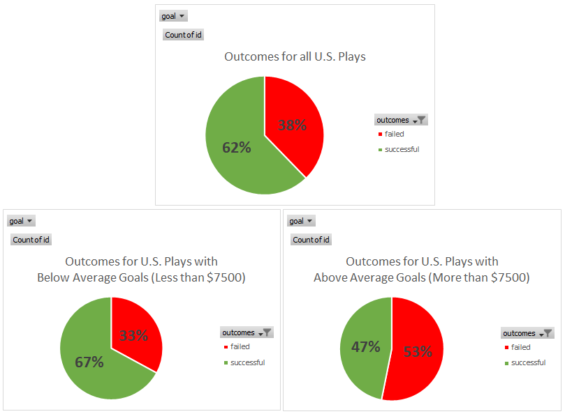

# kickstarter-analysis-M1
Performing analysis on Kickstarter data to uncover trends
## An Analysis of Kickstarter Campaigns
Data in the spreadsheet shows trends for success of Kickstarter campaigns, with focus on theatrical projects.
Outcomes were analyzed based on launch date, country of origin, goals+pledged money.
Descriptive statistics are included for successful and failed U.S.-based Kickstarter campaigns.
## Charts and Graphs
### Project Outcomes by Launch Month

### Project Outcomes by Theatre Subcategories

### Project Outcomes for US Plays - Compared to Average Goal Amount ($7500)

